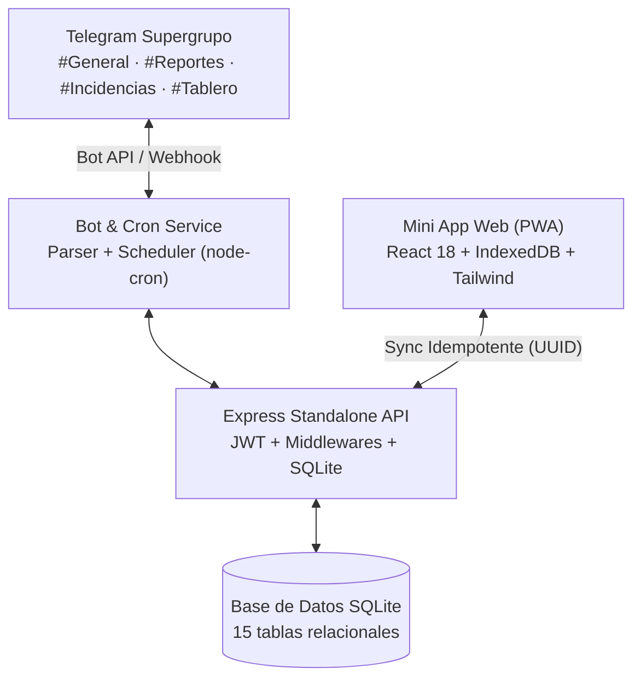

# 🌾 AGROKOOL · Sistema de Operación de Campo y Tablero de Control
## Documentación de Funciones y Especificaciones Técnicas (Patrón TESA)

> **Versión:** 2.2 (Rama `main`)  
> **Identidad de Marca:** **AGROKOOL** (Verde Bosque `#2c4001` • Verde Lima `#a1c62e` • Ocre Dorado `#a87d13`)  
> **Arquitectura:** **TESA** (*Telegram Entry • Standalone API • Offline Storage*)  
> **Base de Datos:** SQLite Relacional (15 tablas)  
> **Frontend:** React 18 + Vite + Tailwind CSS + PWA Service Worker  
> **Backend:** Node.js + Express + node-telegram-bot-api + node-cron  

---

## 📑 Tabla de Contenidos
1. [Arquitectura General](#1-arquitectura-general)
2. [Identidad Visual y Paleta Corporativa](#2-identidad-visual-y-paleta-corporativa)
3. [Canal de Entrada: Bot de Telegram y Supergrupo](#3-canal-de-entrada-bot-de-telegram-y-supergrupo)
4. [Parser Multi-Predio y Confirmación Interactiva](#4-parser-multi-predio-y-confirmación-interactiva)
5. [Automatización y Alertas Programadas (Cron Jobs)](#5-automatización-y-alertas-programadas-cron-jobs)
6. [Mini App Web y Modos por Rol](#6-mini-app-web-y-modos-por-rol)
7. [Autenticación y Modo Sin Conexión (Offline-First)](#7-autenticación-y-modo-sin-conexión-offline-first)
8. [Catálogo Oficial de Datos de AGROKOOL](#8-catálogo-oficial-de-datos-de-agrokool)
9. [Matriz de Endpoints de la API Standalone](#9-matriz-de-endpoints-de-la-api-standalone)
10. [Matriz de Cumplimiento de Especificaciones](#10-matriz-de-cumplimiento-de-especificaciones)

---

## 1. Arquitectura General

El sistema implementa el **Patrón TESA**:
* **Telegram Entry:** Entrada de datos por mensajería en supergrupo con temas, comandos rápidos, confirmaciones interactivas y notificaciones automáticas.
* **Standalone API:** Núcleo de servicios RESTful independientes y desacoplados con SQLite relacional y control estricto de concurrencia e idempotencia.
* **Offline Storage:** Aplicación Web Progresiva (PWA) con almacenamiento local en IndexedDB y validación de PIN en memoria, garantizando operación completa en zonas sin señal celular.



---

## 2. Identidad Visual y Paleta Corporativa

La plataforma utiliza la paleta oficial de **AGROKOOL**:

| Componente | Color | Código Hex | Aplicación en Interfaz |
| :--- | :--- | :---: | :--- |
| **Principal** | Verde Bosque Profundo | `#2c4001` | Barra superior de navegación, botones primarios de acción, títulos y cabeceras. |
| **Acento** | Verde Lima Fresca | `#a1c62e` | Pestañas activas, barras de progreso de metas, puntos de PIN e indicadores de campo. |
| **Alerta / IT**| Ocre Dorado | `#a87d13` | Insignias de administración IT, botón de paro operativo y alertas de mantenimiento. |
| **Superficie** | Lienzo Claro / Blanco | `#f8faf2` / `#ffffff` | Fondo agroecológico suave y tarjetas blancas limpias con bordes `#e2ebd3`. |

---

## 3. Canal de Entrada: Bot de Telegram y Supergrupo

### 📌 Enrutamiento Automático por Temas (`message_thread_id`)
El bot canaliza automáticamente cada evento hacia su tema correspondiente dentro del Supergrupo:
* 🌐 **Tema `#General`:** Resumen diario de proyectos y tareas activas en curso (07:30 hrs).
* 📋 **Tema `#Reportes`:** Publicación de fichas estructuradas de nuevos reportes operativos y declaraciones de días sin actividad.
* ⚠️ **Tema `#Incidencias`:** Publicación de alertas con folios únicos (`F-14`, `F-21`, `INC-2026-XXX`). Quien responde (*reply*) a este mensaje añade notas automáticas a la bitácora de seguimiento.
* 📊 **Tema `#Tablero`:** Publicación del corte diario ejecutivo de las 21:30 hrs y alertas preventivas de maquinaria (300h).

### ⌨️ Comandos Disponibles en Telegram

| Comando | Nivel de Acceso | Descripción |
| :--- | :--- | :--- |
| `/start` o `/menu` | Todos | Menú principal de bienvenida con botones inline a la Mini App y teclado rápido persistente. |
| `/general`, `/proyectos`, `/tareas` | Consulta | Genera el reporte completo de proyectos, hitos y tareas activas en ejecución con sus responsables. |
| `/id` o `/tema` | Administradores | Devuelve el `Chat ID` del grupo y el `message_thread_id` del tema actual para configurar `.env`. |
| `/sin_actividad [motivo]` | Campo | Registra un día de paro operativo (ej. por lluvia torrencial o falta de insumos). |
| `/cerrar [folio] [causa]`| Supervisión | Cierre formal de incidencia con validación estricta de causa raíz ($\ge 10$ caracteres). |
| `/avance` | Consulta | Muestra el resumen de hectáreas habilitadas vs meta por obra activa. |
| `/pendientes` o `/incidencias` | Consulta | Lista todas las incidencias abiertas con sus días de antigüedad. |
| `/maquina` o `/horometro` | Consulta | Muestra el listado de maquinaria, horómetros actuales y alertas de servicio de 300 hrs. |
| `/hoy` o `/tablero` | Consulta | Genera en tiempo real el corte del Tablero de Control del día. |

---

## 4. Parser Multi-Predio y Confirmación Interactiva

El bot procesa mensajes pegados en lenguaje natural con el formato histórico que las cuadrillas ya utilizan en campo:

### 📥 Ejemplo de Entrada:
```
*Obra:* Siembra clúster Mangos
*Fecha:* 20/08/2026

*Fuerza de trabajo :*
- Operador de tractor
- Técnico
- 2 auxiliares

*Operacion actual:*
- Carga de fertilizante de la bodega San Alberto hacia el predio.
- Siembra del predio
- Limpieza de discos del tractor

Se han sembrado un aproximado de 6.5 ha del predio cristina, 7 ha del predio rach y 8 ha del predio los mangos.
```

### ⚙️ Capacidades del Parser:
1. **Despiece Multi-predio Automático:** Separa las menciones de superficies y las asocia a sus respectivos predios (`Cristina: 6.5 ha`, `Rach: 7.0 ha`, `Los Mangos: 8.0 ha`), calculando la sumatoria total (`21.5 ha`).
2. **Cálculo de Fecha Operativa (Tolerancia $\pm 1$ día):** Si el reporte se redactó sin señal y llega pasada la medianoche, respeta la fecha escrita si se encuentra dentro de $\pm 1$ día respecto a la hora del mensaje.
3. **Clasificación de Cuadrilla y Roles:** Mapeo automático de roles (`operador_tractor`, `tecnico`, `auxiliar`, `operador_retro`, etc.) y headcount.
4. **Ficha de Confirmación Interactiva:**
   El bot responde con una tarjeta estructurada en estado **Borrador** con dos botones en línea:
   * **`[ ✅ Confirmar ]`**: Pasa el registro a `confirmado`, actualiza las hectáreas en el sistema y notifica al tema `#Reportes`.
   * **`[ ✏️ Corregir ]`**: Permite al operador enviar una corrección sin generar registros duplicados.

---

## 5. Automatización y Alertas Programadas (Cron Jobs)

El backend incorpora un motor de tareas programadas (`node-cron`) configurado en la zona horaria operativa (`America/Merida` / UTC-6):

* 🌅 **07:30 hrs — Reporte Diario General de Proyectos & Tareas:**
  Publica en el tema `#General` el desglose de proyectos activos, hitos y tareas en ejecución con sus metas, acumulados y responsables asignados.
* 🔔 **08:00 hrs — Alertas Matutinas:**
  Notifica incidencias abiertas por más de 3 días en `#Incidencias`, y alerta si alguna máquina tiene $\ge 280$ hrs (a menos de 20 hrs del servicio obligatorio de 300 hrs).
* 🔴 **21:00 hrs — Reclamo de Obras Sin Reporte:**
  Evalúa todas las obras activas en estado de `operacion`. Si no registran reporte ni `/sin_actividad`, envía un aviso automático al tema de la obra reclamando el reporte de jornada.
* 📊 **21:30 hrs — Corte Oficial del Tablero:**
  Genera el corte diario consolidado (obras sin reporte, avance vs meta, incidencias abiertas, materiales con déficit y maquinaria en alerta) y lo publica y fija en el canal/tema `#Tablero`.
* 🧪 **Disparador Manual de Pruebas:**
  Endpoint `POST /api/stats/cron-trigger` y panel en la pestaña **Admin IT** para probar cualquiera de los cuatro ciclos en cualquier momento.

---

## 6. Mini App Web y Modos por Rol

La interfaz web (PWA) adapta su navegación y funciones según el rol del usuario autenticado:

### 🚜 1. Vista de Campo (`campo_user` · PIN `1234`)
* Formulario táctil de reporte diario con selectores en cascada (*Proyecto ➔ Hito ➔ Tarea ➔ Obra ➔ Predio*).
* Barra dinámica de progreso de la tarea seleccionada.
* Desglose de cuadrilla con steppers rápidos (+ / -).
* Lectura de horómetros de maquinaria (inicio, fin, horas y litros de diésel consumidos).
* Botón de emergencia **"🌧️ Declarar Día Sin Actividad"** en 1 solo toque.
* Cola de sincronización local (IndexedDB) con indicador visual de reportes pendientes de envío.

### 👷 2. Vista de Supervisor (`sup_user` · PIN `2345`)
* **4 Widgets Canónicos de Control:**
  1. *Obras sin reporte hoy* (con cálculo de días de atraso).
  2. *Avance contra meta & Validación Dron* (porcentaje ejecutado vs programado).
  3. *Incidencias abiertas* (tipo, días y frente).
  4. *Bloqueado por material* (déficit de insumos y fecha ETA).
* Gestión de Estructura de Desglose de Trabajo (**WBS**): Crear, editar y eliminar Proyectos, Hitos y Tareas.
* **Cierre Formal de Incidencias:** Modal con validación estricta de causa raíz ($\ge 10$ caracteres).
* Semáforo de mantenimiento preventivo de maquinaria (alerta 300h con botón de registro de servicio).

### 📊 3. Vista de Dirección (`dir_user` · PIN `3456`)
* Tablero de KPIs consolidados del ciclo agrícola.
* **Comparativa Dron vs Campo:** Hectáreas estimadas en campo vs hectáreas oficiales medidas por ortofoto de Dron, calculando la discrepancia neta.
* Consumo total de diésel acumulado y horas efectivas de maquinaria.
* Resumen ejecutivo de avance global contra la meta consolidada de hectáreas.

### 🛡️ 4. Vista de Administrador IT (`admin_user` · PIN `9999`)
* Monitor de salud del servidor (`/api/health`), base de datos SQLite y memoria.
* Diagnóstico de conexión del Bot de Telegram y Webhooks.
* Control de usuarios, roles y asignación de códigos PIN de 4 dígitos.
* Disparadores manuales para simular los Cron Jobs de las 07:30, 08:00, 21:00 y 21:30 hrs.

---

## 7. Autenticación y Modo Sin Conexión (Offline-First)

* **PIN Numérico de 4 Dígitos:** Teclado táctil optimizado para pantallas bajo el sol o uso con guantes. En cuanto se digitan los 4 números, valida en **0.2 segundos**.
* **Sesión Persistente:** El navegador recuerda al operador; al reabrir la app no vuelve a pedir el PIN salvo que se pulse *"Cerrar Sesión / Cambiar Operador"*.
* **100% Offline:** El catálogo de operadores y predios se almacena en `localStorage` / `IndexedDB`, permitiendo validar el PIN y guardar reportes sin señal de red.
* **Idempotencia Criptográfica:** Cada reporte genera un `client_uuid` único; el servidor descarta reenvíos duplicados automáticamente al recuperar la señal.

---

## 8. Catálogo Oficial de Datos de AGROKOOL

### 🗺️ Predios Reales de Campeche (con GeoJSON):
1. **Guayeme:** 37.67 ha legales · Propiedad Privada · 12 vértices.
2. **San Alberto:** 11.04 ha legales · Propiedad Privada · 10 vértices.
3. **Los Mangos:** 12.47 ha legales · Tubería CAPAE y triángulo de 2 ha.
4. **Rach:** 1.83 ha legales.
5. **Cristina:** 5.51 ha legales.
6. **Santa Teresita:** 521.00 ha legales · 450.0 ha útiles mecanizables.
7. **San Luis:** 16.03 ha legales · 5 postes CFE.
8. **La Asunción:** 146.48 ha legales.
9. **San Pedro:** 180.41 ha legales · En trámite RPP.
10. **Parque Jabin:** 80.00 ha legales · Régimen Patrimonial.
11. **Potrero Yeguas:** 120.00 ha legales · Infraestructura Ganadera.

### 🏢 Obras de Operación:
* `Maíz Guayeme` (Tema `#Guayeme · Maíz`)
* `Desmonte Santa Teresita` (Tema `#Sta Teresita · Desmonte`)
* `Siembra clúster Mangos` (Tema `#Clúster Mangos · Siembra`)
* `Maíz San Alberto` (Tema `#San Alberto · Maíz`)
* `San Luis` (Standby por lluvia)
* `Reforestación Jabin` (Mantenimiento)
* `Cercado Potrero Yeguas` (Cercado y corrales)

### 🚜 Parque de Maquinaria:
* **Tractor CASE IH Puma 155 (Aspromex):** `TRACTOR-PUMA-01` · Horómetro: 288.5 hrs ➔ **🚨 Alerta Preventiva 300H**.
* **Bulldozer Caterpillar D6:** `BULLDOZER-CAT-D6` · Horómetro: 1,420.0 hrs.
* **Retroexcavadora New Holland (Alfredo):** `RETRO-NEW-HOLLAND` · Horómetro: 286.5 hrs ➔ **🚨 Alerta Preventiva 300H**.
* **Dron DJI Agras T70P (Abner):** `DRON-AGRAS-T70P` · Horómetro: 45.0 hrs.
* **Sembradora Case PRO 6 Hileras:** `SEMBRADORA-CASE-PRO6` · Horómetro: 62.0 hrs.

---

## 9. Matriz de Endpoints de la API Standalone

| Método | Ruta | Rol Requerido | Descripción |
| :--- | :--- | :---: | :--- |
| `GET` | `/api/health` | Público | Estado de salud del backend y base de datos. |
| `POST` | `/api/auth/pin-login` | Público | Autenticación rápida por PIN de 4 dígitos. |
| `POST` | `/api/auth/login` | Público | Autenticación tradicional por usuario y password. |
| `GET` | `/api/auth/operators` | Público | Catálogo de operadores para caché offline. |
| `POST` | `/api/reports/sync` | Autenticado | Sincronización masiva e idempotente de reportes. |
| `GET` | `/api/reports` | Autenticado | Consulta de bitácora de reportes con filtros. |
| `GET` | `/api/stats/supervisor` | Supervisor / IT | Retorna los 4 widgets canónicos y estado de maquinaria. |
| `GET` | `/api/stats/direction` | Dirección / IT | Retorna KPIs ejecutivos y comparativa Dron vs Campo. |
| `POST` | `/api/stats/cron-trigger`| Supervisor / IT | Disparo manual de pruebas para alertas (07:30, 08:00, 21:00 y 21:30 hrs). |
| `GET` | `/api/issues` | Autenticado | Listado de incidencias activas con cálculo de días. |
| `POST` | `/api/issues` | Autenticado | Registro de nueva incidencia con folio automático. |
| `POST` | `/api/issues/:id/close` | Supervisor / IT | Cierre con validación estricta de causa raíz ($\ge 10$ chars). |
| `GET` | `/api/machines` | Autenticado | Catálogo de maquinaria y estado de servicio preventivo. |
| `GET` | `/api/materials` | Autenticado | Listado de insumos con cálculo de déficit y alertas ETA. |
| `GET` | `/api/projects` | Autenticado | Árbol WBS de Proyectos, Hitos, Tareas y Predios. |
| `GET` | `/api/users` | Admin IT | Catálogo de usuarios y asignación de PIN. |

---

## 10. Matriz de Cumplimiento de Especificaciones

| Requerimiento / Especificación | Estado | Evidencia / Componente |
| :--- | :---: | :--- |
| **Patrón TESA (Telegram Entry, Standalone API, Offline Storage)** | ✅ Cumplido | Backend desacoplado en Express, Bot en `node-telegram-bot-api`, PWA con IndexedDB. |
| **Autenticación con PIN 4 Dígitos & Sesión Persistente** | ✅ Cumplido | `LoginView.jsx`, `pin-login` endpoint, `localStorage` para sesión sin re-logins innecesarios. |
| **Parser Multi-predio con Confirmación Interactiva** | ✅ Cumplido | `server/bot/parser.js`, despiece de Cristina/Rach/Mangos, botones `[✅ Confirmar]` / `[✏️ Corregir]`. |
| **Cron Jobs Automatizados (4 Horarios)** | ✅ Cumplido | `server/bot/cron.js` (07:30 General Proyectos/Tareas, 08:00 Matutinas, 21:00 Reclamos, 21:30 Tablero). |
| **4 Widgets Canónicos de Supervisión** | ✅ Cumplido | `SupervisorView.jsx` (Sin reporte, Avance vs Meta, Incidencias, Materiales bloqueados). |
| **Cierre de Incidencias con Validación de Causa Raíz** | ✅ Cumplido | `server/routes/issues.js` (Rechaza strings $< 10$ caracteres con HTTP 400). |
| **Auditoría Dron vs Campo & Discrepancias** | ✅ Cumplido | `DireccionView.jsx` y `server/routes/stats.js` (Cálculo de discrepancia neta en Ha y %). |
| **Gestor de Estructura WBS (Proyectos, Hitos, Tareas)** | ✅ Cumplido | `SupervisorView.jsx` pestaña *Gestor de Proyectos & Hitos* con CRUD completo. |
| **Idempotencia en Sincronización Offline** | ✅ Cumplido | `server/routes/reports.js` (`client_uuid` previene duplicados en re-intentos de red). |
| **Branding Oficial AGROKOOL** | ✅ Cumplido | Paleta `#2c4001`, `#a1c62e`, `#a87d13`, logotipo transparente `AGROKOOL_BLANCO.png`. |
| **Modo Claro Corporativo y Modo Oscuro** | ✅ Cumplido | `ThemeContext.jsx`, Tailwind `darkMode: 'class'`, alto contraste bajo el sol. |

---

*Documento auditado y validado contra el código base en producción (`main`).*
